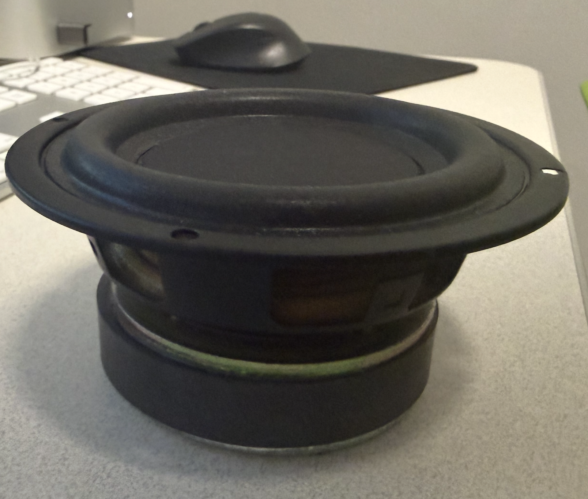
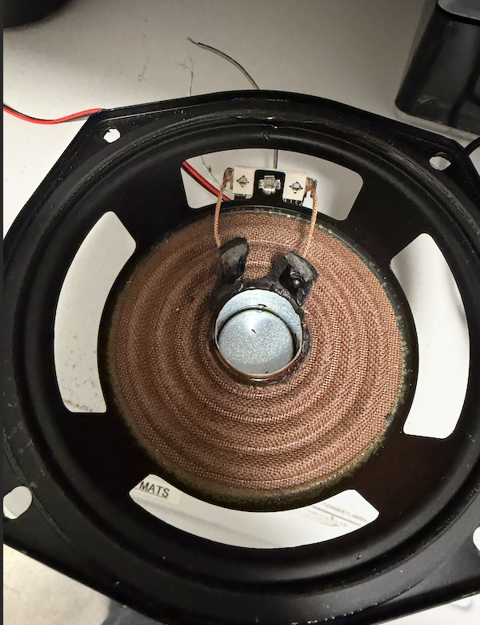
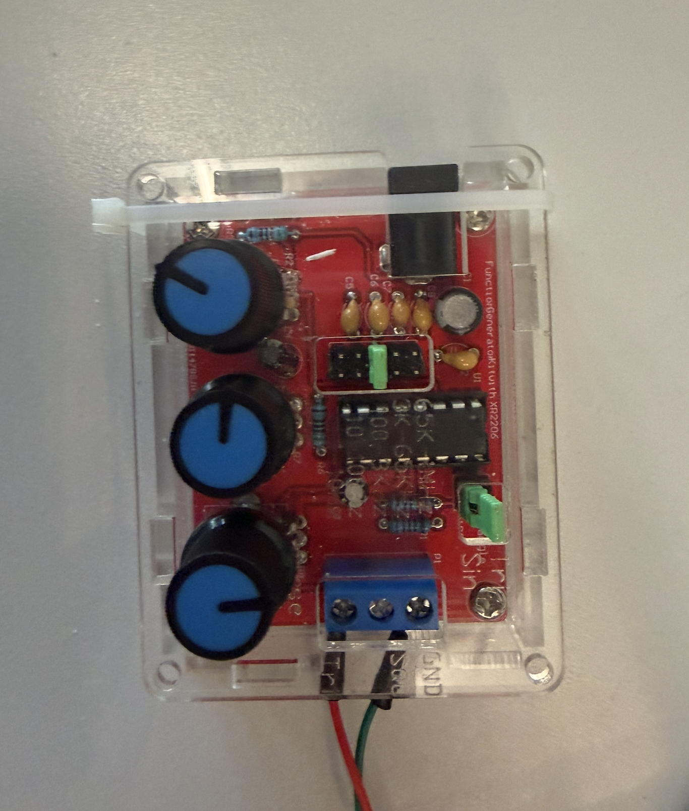
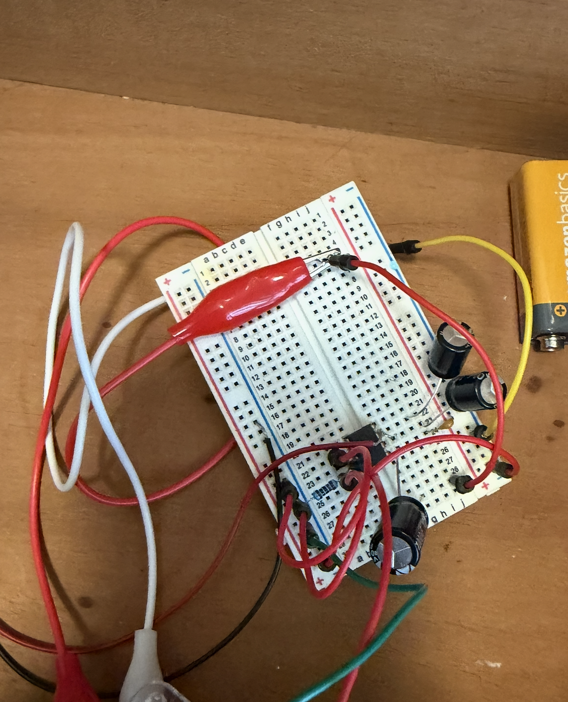
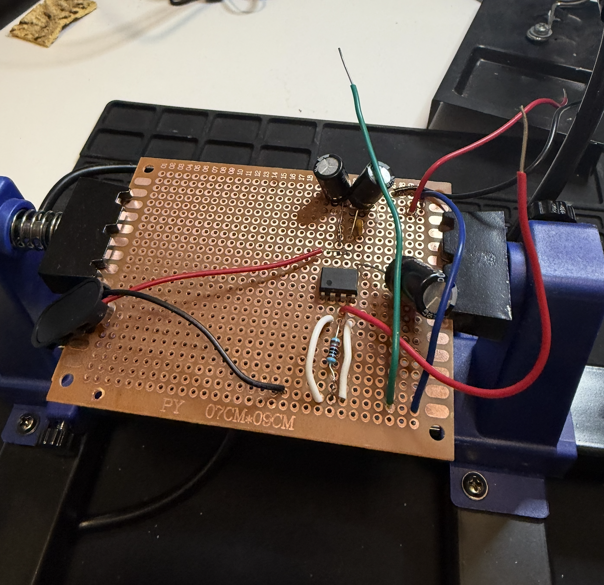
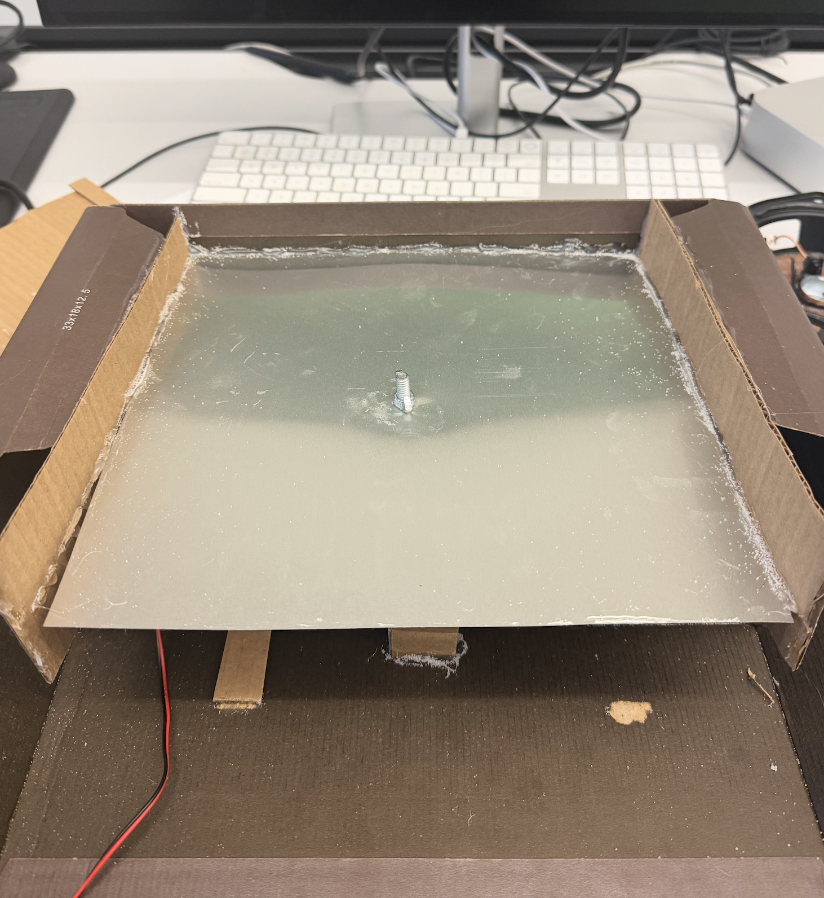
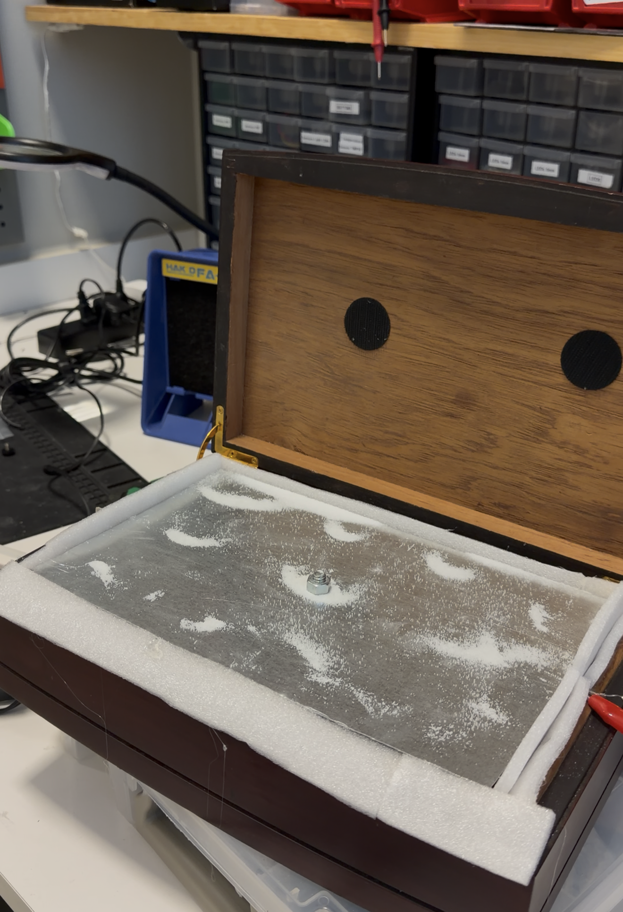

# Portable Audio-Driven Sand/Salt Wave Visualizer

**Milestones:** [01](milestone-01.md) | [02](milestone-02.md) | [03](milestone-03.md)

---

## Overview

This project explores the design and construction of a **Portable Audio-Driven Sand/Salt Wave Visualizer** — a system that makes sound vibrations visible through pattern formation on a vibrating surface.

By applying controlled audio frequencies to a steel plate, salt particles move and settle into nodal patterns, revealing how wave behavior operates in a physical system. While inspired by traditional Chladni plate experiments, this project focuses on building a **low-cost, portable, and self-constructed version** using accessible materials.

**This repository includes:**
- Images of pattern formation at different frequencies
- Videos demonstrating real-time vibration effects
- DevLogs documenting iterative progress and experimentation

---

## Final Prototype

Below is the final prototype in action, showcasing the system's ability to create visible patterns through sound-induced vibrations.

*Figure 1: The completed portable sand wave visualizer in operation*

---

## Concept & Inspiration

This project is inspired by Chladni plate experiments, which demonstrate how sound waves create geometric patterns on vibrating surfaces.

Rather than directly replicating the original setup, this project reinterprets the idea through:
- Portable design constraints
- Improvised materials and hardware
- Focus on real-world resonance behavior

The concept connects directly to course themes of:
- Physical computing
- Signal behavior and wave interaction
- The relationship between digital input (frequency) and physical output

A key focus was understanding how **resonance** determines whether patterns form at all.

---

## Objectives

- Build a functional Chladni board using accessible materials
- Generate visible nodal patterns using sound frequencies
- Investigate how frequency, amplitude, and physical setup affect pattern formation
- Evaluate the limitations of the system

---

## Materials & Construction

### Components

| Item | Source | Cost |
|------|--------|------|
| Karaoke speaker | Goodwill | $2 |
| Metal plate | Lowe's | $8 |
| Frequency generator | Provided by Dr. Mundy | — |
| Salt | Local store | $3 |
| Mounting structure | Ace Hardware / Habitat for Humanity | — |

**Also used:** bolts, nuts, washers, screw, bottle cap, hot glue, amplifier components.

---

### Construction Process

**1. Speaker Preparation**  
I started by repurposing a thrifted speaker, removing the cone to allow for direct vibration of the steel plate.

| | |
|---|---|
|  |  |
| *Figure 2: Thrifted speaker used as the base* | *Figure 3: Speaker after cone removal* |

**2. Signal Generation**  
I used a signal generator to produce the desired frequencies, which were then fed into the amplifier circuit to drive the speaker.

  
*Figure 4: Signal generator used for frequency control*

**3. Amplifier Circuit**  
I built a simple amplifier circuit to boost the signal from the generator, ensuring it was strong enough to cause visible vibrations in the steel plate.

First, I quickly prototyped the amplifier on a breadboard using basic components to achieve the necessary gain.

  
*Figure 5: Initial amplifier circuit prototyped on a breadboard*

Then I soldered the components onto a perfboard for a more permanent solution, ensuring reliable connections for the final setup.

  
*Figure 6: Amplifier circuit soldered onto perfboard for stability*

**4. Making the Transducer**  
I created a makeshift transducer using a bottle cap and hot glue to connect the speaker's vibration to the steel plate effectively. A screw through the center of the cap secures it to the plate, allowing for better transmission of vibrations.

**5. Mounting the Plate**  
I securely mounted the steel plate onto the speaker using bolts and washers, ensuring good contact for effective vibration transmission.

I made a prototype mounting structure using a scrap box and a "No Trespassing" sign, which provided a stable base while allowing adjustments to optimize vibration.

  
*Figure 7: Initial mounting structure using scrap materials*

**6. Testing & Iteration**  
I experimented with different frequencies and amplitudes, adjusting the setup to optimize pattern visibility while managing material limitations.

  
*Figure 8: Testing different frequencies to observe pattern formation*

**7. Corrections**  
Once I realized the patterns and setup weren't as stable as needed, I made several adjustments to improve the system's performance. I also spray-painted the mounting structure to make the patterns more visible.

  
*Figure 9: Adjusted mounting structure for improved stability and pattern visibility*

---

## Results

The project successfully demonstrates how resonance produces visible nodal patterns. While intricate patterns were difficult to achieve, the system effectively illustrates the relationship between sound frequency and physical structure.

---

## Key Learning: Resonance

One of the most important takeaways from this project was how critical resonance is to the system.

At first, I assumed that increasing frequency would naturally produce more complex patterns. However, the results showed that:
- Only specific frequencies produced clear patterns
- Many frequencies resulted in little to no movement
- Some frequencies created chaotic, unstable motion

This led to the realization:

> **Patterns only emerge when the system reaches resonant frequencies that align with the physical properties of the plate.**

This shifted my understanding from thinking of sound as continuous input to recognizing that **the system selectively responds to certain frequencies based on its structure.**

---

## Reflection

This project created a deeper understanding of how theoretical concepts behave in practice. In particular, it highlighted:
- The importance of resonance in physical systems
- The limitations of simplified or low-resource implementations
- The role of iteration in refining both design and understanding

The most valuable outcome was not just producing patterns, but understanding **why** they form and why they sometimes do not.

---

## Demo

*Figure 10: The completed portable sand wave visualizer in operation*